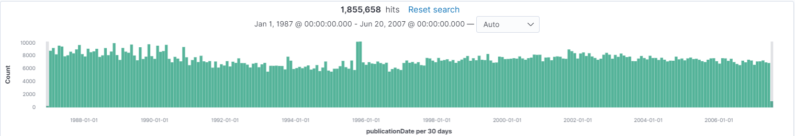

# nytcorpus

Tools for working with the NYT Corpus.

## New York Times Annotated Corpus

* [catalog.ldc.upenn.edu/LDC2008T19](https://catalog.ldc.upenn.edu/LDC2008T19)

## Build/config

~~~~
$ mvn clean package
~~~~

* application.properties

~~~~
# NYT Corpus "data" directory:
nytcorpus.corpus=/data/nytcorpus/data

# Solr host/port:
nytcorpus.solr.host=http://localhost
nytcorpus.solr.port=8983

# Elastic host/port:
nytcorpus.elastic.host=localhost
nytcorpus.elastic.port=9200

# Directory for writing out TREC <DOC>'s:
nytcorpus.trecdocs=/data/nytcorpus/trecdocs
~~~~

## TREC \<DOC>s

"YYYY-MM.gz" bundles of TREC \<DOC>s from the NYT corpus:

~~~~
$ java -jar target/nytcorpus.jar trecdocs
~~~~

## Index the NYT corpus into Solr

~~~~
$ ./nytcorpus.sh
$ java -jar target/nytcorpus.jar solr
~~~~

## Index the NYT corpus into Elasticsearch

~~~~
$ java -jar target/nytcorpus.jar elastic
~~~~

